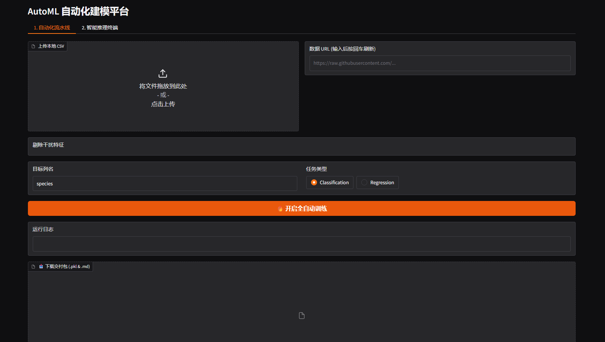
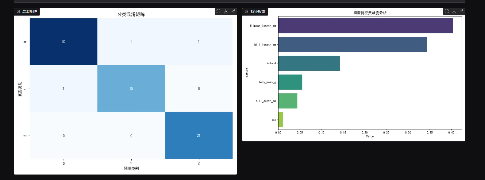
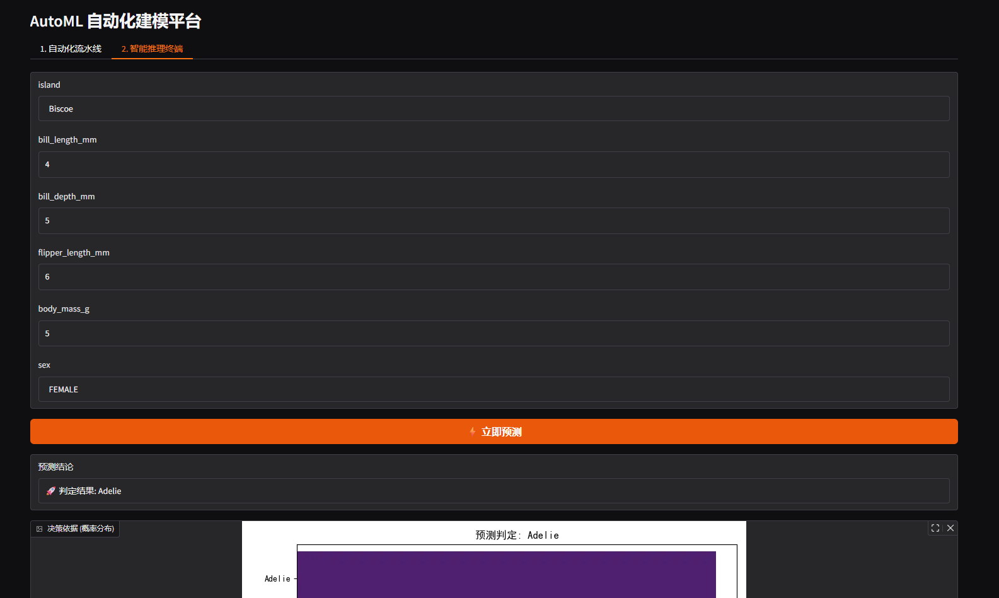

# 🤖 Universal AutoML 商业级全自动建模平台 Pro

**Universal AutoML** 是一款轻量级、交互式的自动化机器学习平台。它实现了从原始 CSV 数据导入、特征工程自动化、模型训练调优到最终推理部署的全生命周期管理。

**Universal AutoML** is a lightweight, interactive platform designed to manage the full ML lifecycle—from data ingestion and automated feature engineering to model tuning and deployment.

## ✨ 界面演示 | Demo

### 1. 自动化训练与特征剔除 | Automated Training & Feature Selection
上传本地 CSV 或输入 URL，系统自动加载列名，支持手动勾选剔除干扰特征，动态刷新表单。

### 2. 可视化评估报告 | Visual Analytics
训练完成后，自动生成黑盒模型的决策证据：**混淆矩阵**与**特征贡献度热力图**。

### 3. 智能推理终端 | Inference Interface
动态生成推理表单，支持多类别概率分布展示，让模型判定决策过程透明化。

---

## ✨ 核心功能 | Key Features

- **全自动流水线 (Automated Pipeline)**：支持本地 CSV 上传及 **URL 远程加载**。系统自动执行缺失值众数填充与类别特征编码（Label Encoding）。
- **交互式特征管理 (Interactive Feature Selection)**：动态提取数据集列名，支持手动勾选剔除干扰特征，并内置目标列保护机制。
- **可视化决策支持 (Visual Analytics)**：实时生成**混淆矩阵**与**特征贡献度热力图**，让“黑盒”模型变得透明易懂。
- **一键交付资产 (One-Click Deliverables)**：训练结束后自动打包导出 `.pkl` 模型文件与一份自动生成的 **Markdown 技术报告（模型名片）**。
- **双端推理支持 (Inference Support)**：内置 Gradio 交互式推理终端（支持概率分布展示）及独立的 `predict_service.py` 脚本。

------

## 🛠️ 技术栈 | Tech Stack

- **Core Engine**: FLAML (Fast and Lightweight AutoML)
- **Interface**: Gradio (Web GUI)
- **Algorithms**: Scikit-Learn (Random Forest, XGBoost, LightGBM 等由 FLAML 自动选择)
- **Reporting**: Markdown 自动化渲染

------

## 🚀 快速开始 | Quick Start

### 1. 环境准备 | Environment

建议使用 Python 3.8+ 环境，安装以下依赖：

Bash`pip install pandas gradio flaml matplotlib seaborn Pillow joblib scikit-learn`

### 2. 启动平台 | Launching the Platform

运行主程序进入交互式 Web 界面：

Bash`python AutoML.py`

- **提示**：输入数据 URL 后，请按 **回车(Enter)** 或点击空白处以刷新特征列表。

### 3. 本地推理调用 | Local Inference

使用生成的模型文件进行快速预测：

Python`from predict_service import fast_predict# 准备输入字典 (需对应原始列名)test_data = {"island": "Biscoe", "bill_length_mm": 39.1, "flipper_length_mm": 181}result = fast_predict(test_data)print(result) # 输出预测结论与置信度`

------

## 📂 仓库结构 | Repository Structure

- `AutoML.py`: 集成化训练平台，包含数据处理、FLAML 引擎、可视化及资产导出逻辑。
- `predict_service.py`: 生产级推理脚本，支持模型加载与单条/批量预测。
- `requirements.txt`: 项目运行所需的库清单。
- `sample_data/`: (建议创建) 存放示例数据集如 `penguins.csv`。

------

## 📋 交付物说明 | Project Deliverables

本项目在训练完成后会自动生成以下资产：

1. **automl_model.pkl**: 包含模型权重、特征元数据及预处理转换器的二进制包。
2. **模型技术名片.md**: 详细记录了训练时间、最优算法选型、特征重要性等关键信息的自动化报告。

------

## 🤝 关于作者 | Author

**Machao**

- Software Engineering Student
- Focusing on AI-Inference Engineering & Automated Machine Learning